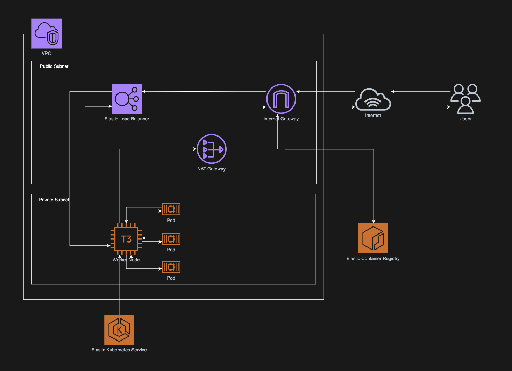

# EKS Infra for DistilBERT Serving

This directory contains the AWS infrastructure and Kubernetes setup for deploying the DistilBERT sentiment analysis API on Amazon EKS.

The goal of this setup is simple: take the local Kubernetes version of the project and run it in AWS with the core pieces needed for a more realistic environment.

## What This Setup Includes

- VPC with public and private subnets across 2 Availability Zones
- Internet Gateway and NAT Gateway
- EKS cluster and managed node group
- ECR repository for the container image
- Kubernetes `Deployment` and `Service` manifests
- k6 load testing script
- Prometheus and Grafana for monitoring

## Architecture Overview



The worker nodes run in private subnets, while public-facing traffic enters through an AWS load balancer.

High-level request flow:

`User -> Load Balancer -> EKS worker node -> Pod`

Image pull / outbound flow:

`Worker node -> NAT Gateway -> Internet / ECR`

This is why the setup needs both:
- a **LoadBalancer** service, so the app has a stable public endpoint
- a **NAT Gateway**, so nodes in private subnets can still pull images and reach external services

## Current Configuration

### AWS
- Region: `us-east-1`
- VPC CIDR: `10.0.0.0/16`
- 2 public subnets
- 2 private subnets

### EKS
- Cluster authentication mode: API
- Kubernetes version in Terraform: `1.35`
- Node group instance type: `t3.medium`
- Node group size: min=1, max=1, desired=1

### Kubernetes App
- Replicas: `3`
- Service type: `LoadBalancer`
- Resource requests:
  - CPU: `50m`
  - Memory: `500Mi`
- Resource limits:
  - CPU: `1000m`
  - Memory: `500Mi`

## Project Files

- `main.tf` - provider and base Terraform configuration
- `vpc.tf` - VPC, subnets, IGW, NAT Gateway, route tables
- `eks.tf` - EKS cluster and node group
- `ecr.tf` - ECR repository
- `iam.tf` - IAM roles and policy attachments
- `variables.tf` - input variables
- `outputs.tf` - useful outputs
- `deployment.yaml` - Kubernetes deployment
- `service.yaml` - Kubernetes service
- `load_test.js` - k6 load test

## Prerequisites

- Terraform
- AWS CLI
- kubectl
- Docker
- Helm
- k6
- An AWS account with permission to create EKS, VPC, IAM, and ECR resources

## 1. Provision the Infrastructure

```bash
terraform init
terraform apply
```

## 2. Build and Push the Image to ECR

Log in to ECR:

```bash
aws ecr get-login-password --region us-east-1 | \
  docker login --username AWS --password-stdin <account-id>.dkr.ecr.us-east-1.amazonaws.com
```

Build, tag, and push:

```bash
docker build -t distilbert-serving .
docker tag distilbert-serving:latest <account-id>.dkr.ecr.us-east-1.amazonaws.com/distilbert-serving-ecr-repo:latest
docker push <account-id>.dkr.ecr.us-east-1.amazonaws.com/distilbert-serving-ecr-repo:latest
```

## 3. Connect to the EKS Cluster

Update kubeconfig:

```bash
aws eks update-kubeconfig \
  --region us-east-1 \
  --name distilbert-serving-eks-cluster
```

If needed, create an access entry for your AWS identity:

```bash
aws eks create-access-entry \
  --cluster-name distilbert-serving-eks-cluster \
  --principal-arn $(aws sts get-caller-identity --query Arn --output text) \
  --region us-east-1

aws eks associate-access-policy \
  --cluster-name distilbert-serving-eks-cluster \
  --principal-arn $(aws sts get-caller-identity --query Arn --output text) \
  --policy-arn arn:aws:eks::aws:cluster-access-policy/AmazonEKSClusterAdminPolicy \
  --access-scope type=cluster \
  --region us-east-1
```

## 4. Deploy the Application

```bash
kubectl apply -f deployment.yaml
kubectl apply -f service.yaml
```

Check the external endpoint:

```bash
kubectl get service distilbert-service
```

Example request:

```bash
curl -X POST http://<elb-url>:8080/analyze \
  -H "Content-Type: application/json" \
  -d '{"text": "This movie was absolutely fantastic!"}'
```

## 5. Run a Load Test

```bash
k6 run load_test.js
```

Main metrics to watch:
- `http_req_duration`
- `http_req_failed`
- `http_reqs`

## 6. Set Up Monitoring

Install Prometheus and Grafana with Helm:

```bash
helm repo add prometheus-community https://prometheus-community.github.io/helm-charts
helm repo update
helm install kube-prometheus-stack prometheus-community/kube-prometheus-stack \
  --namespace monitoring \
  --create-namespace
```

Port-forward Grafana:

```bash
kubectl port-forward -n monitoring svc/kube-prometheus-stack-grafana 3000:80
```

Get the Grafana admin password:

```bash
kubectl get secret -n monitoring kube-prometheus-stack-grafana \
  -o jsonpath="{.data.admin-password}" | base64 --decode
```

## Cleanup

Before running `terraform destroy`, delete the Kubernetes resources first:

```bash
kubectl delete -f service.yaml
kubectl delete -f deployment.yaml
```

Then destroy the AWS infrastructure:

```bash
terraform destroy
```

This matters because the `LoadBalancer` service creates AWS resources that can block VPC deletion if they still exist.
